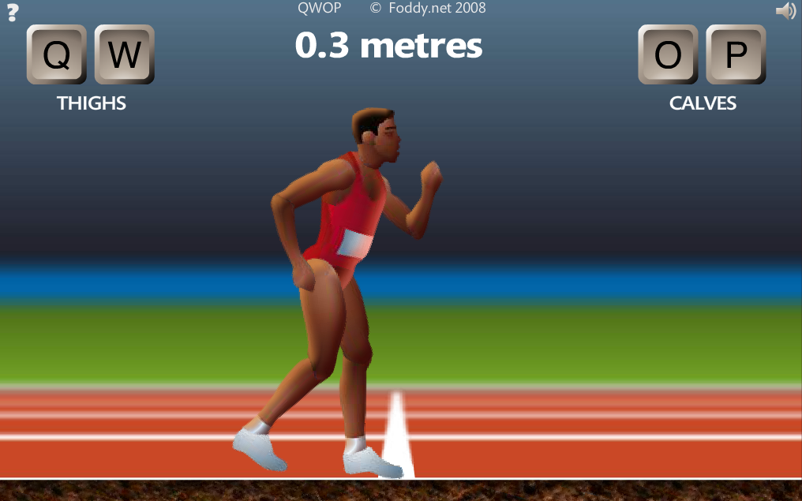

# QWOP-AI

> An Olympic machine learning endeavor

## Goal

We will create a machine learning program that learns how to play QWOP, a browser-based video game in which the player needs to control an Olympic athlete by moving his thighs and calves with the Q, W, O, and P keys on the keyboard.

## Discussion

### Anticipated Challenges

Machine learning is a new topic for all of us, which presents the challenge of the “new technology learning curve.” This project may especially benefit from critical path analysis and a Gantt chart, because significant research into machine learning will need to be done upfront to avoid laying a bad foundation for the rest of the app. However, our team will need to work concurrently on various parts of the game during this research period to avoid a bottleneck in development. As long as we can lay out a clear development strategy, we should be able to mitigate the effects of the new technology learning curve.

### Benefits to the Customer

Videos of QWOP-AI playing the game has the potential for significant revenue on YouTube or other streaming media channels. Gameplay footage is one of the most popular types of online streaming video. The #1 most popular YouTube channel for several years has been PewDiePie, which features video gameplay footage with commentary and pulls in over $10 million per year.

## Deliverables

We will deliver a Minimum Viable Product (MVP) with the following functionality:

- Learns how to play the QWOP video game.
- Improves its performance (fitness) over time as it plays and receives feedback.
- Provides persistent storage of learned information.
- Capable of playback at different stages of learning.

The MVP and the extended product will be delivered to the client by 6 December 2016.

Maintenance requests for QWOP-AI can be made by creating new GitHub Issues in the repository.

## Timeline

- 8 November 2016: Team Composition form submitted.
- 12 November 2016: Project Proposal submitted. Planning begins.
- 17 November 2016: Planning complete. Development begins.
- 1 December 2016: Minimum Viable Product completed. Retrospective Study begins.
- 6 December 2016: Product and Retrospective Study delivered. Submission time deadline: 8:00 pm

## Other Thoughts

Time permitting, our developers will try different machine learning approaches in order to have the best chance of satisfactory results. These learning approaches include, but are not limited to:

- Decision tree learning
- Artificial neural networks
- Reinforcement learning
- Genetic algorithms

The original website for QWOP can be found at https://www.foddy.net/Athletics.html.

## Authors

International Justice League of Super Acquaintances (IJLSA)

- Brody Concannon
- Nathan Karasch
- Stefan Kraus
- Gregory Steenhagen
